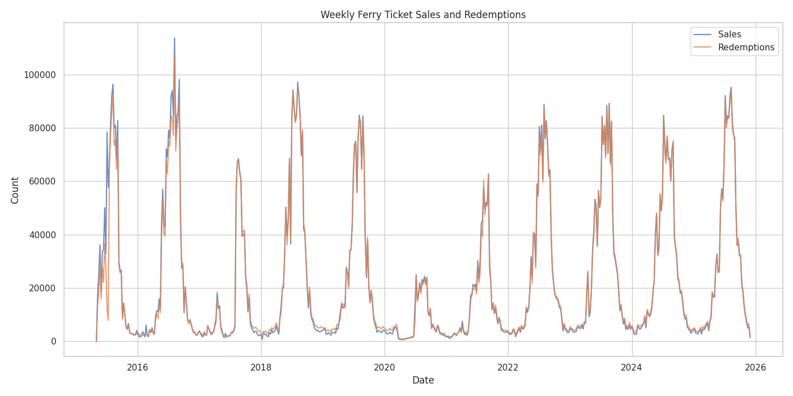
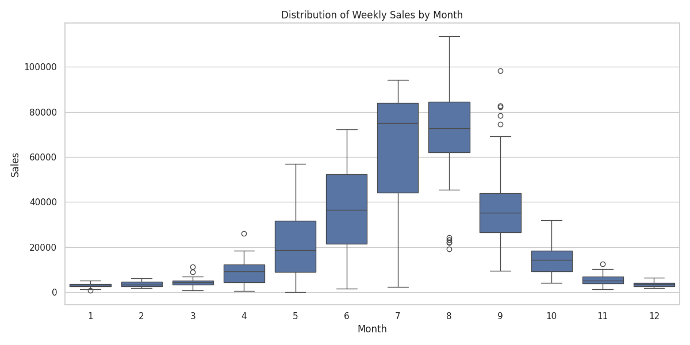
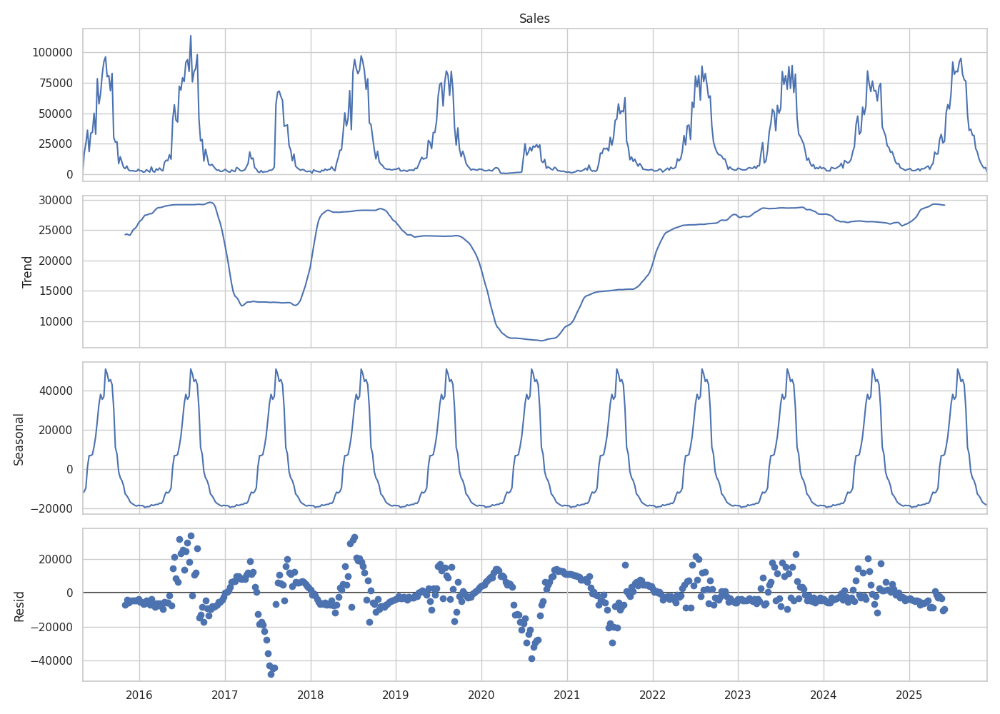
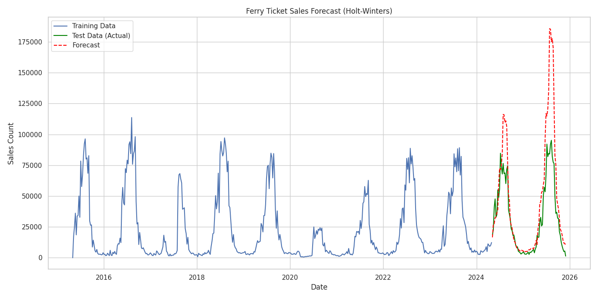

# Toronto Island Park Ferry Ticket Analysis

This project analyzes the Toronto Island Ferry ticket counts time series data to understand historical trends, seasonality, and forecast future sales.

## Analysis Overview

The analysis pipeline includes:
1.  **Data Preprocessing**: Resampling 15-minute interval data to weekly frequency to smooth out noise and highlight broader trends.
2.  **Exploratory Data Analysis (EDA)**: Visualizing sales and redemptions over time and analyzing monthly seasonality.
3.  **Time Series Decomposition**: Breaking down the series into trend, seasonal, and residual components.
4.  **Forecasting**: Using Holt-Winters Exponential Smoothing to predict future ticket sales.

## Key Insights

### 1. Sales and Redemptions Trends
The weekly sales and redemptions show a clear pattern over the years.

### 2. Seasonality
There is a strong annual seasonality with significant peaks during the summer months (June, July, August), as expected for a park destination.

### 3. Time Series Decomposition
Decomposition reveals the underlying trend and the consistent seasonal component.

## Forecasting Model

A Holt-Winters Exponential Smoothing model was trained on the data. The model captures the seasonal patterns well.

**Model Performance:**
- **RMSE (Root Mean Squared Error)**: 29,359.37
- **MAE (Mean Absolute Error)**: 17,146.92

## Usage

To reproduce the analysis:
1.  Ensure dependencies are installed: `pip install pandas matplotlib seaborn statsmodels scikit-learn`
2.  Run the analysis script: `python code/run_analysis.py`
